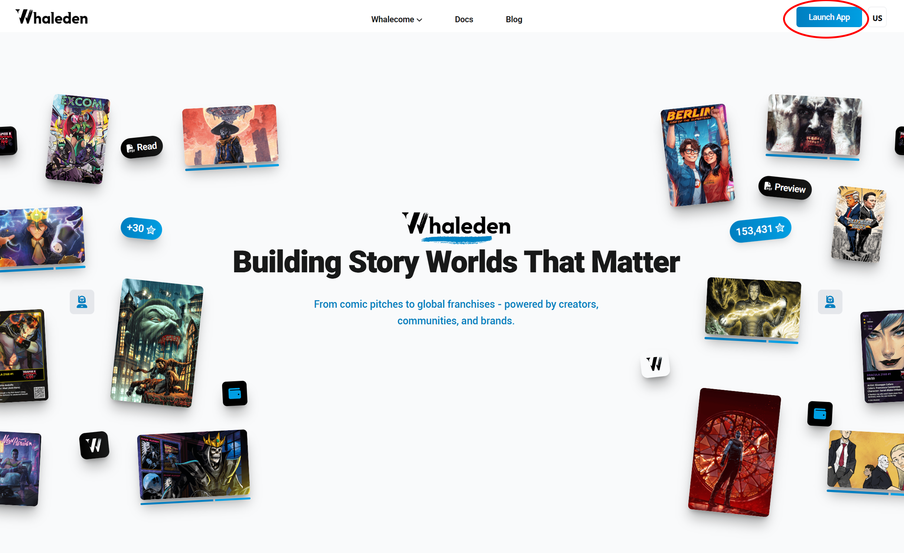
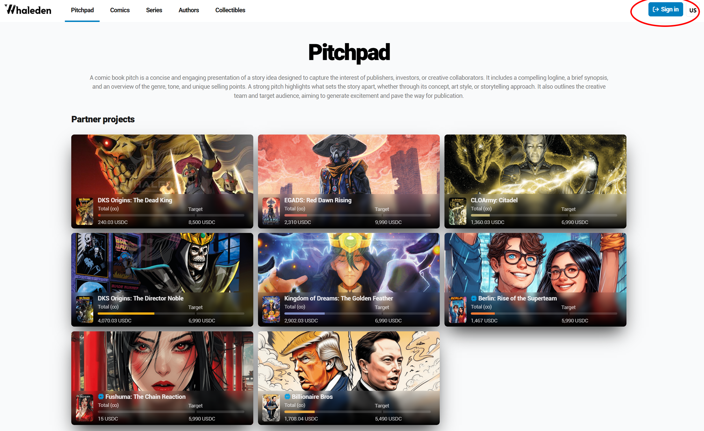
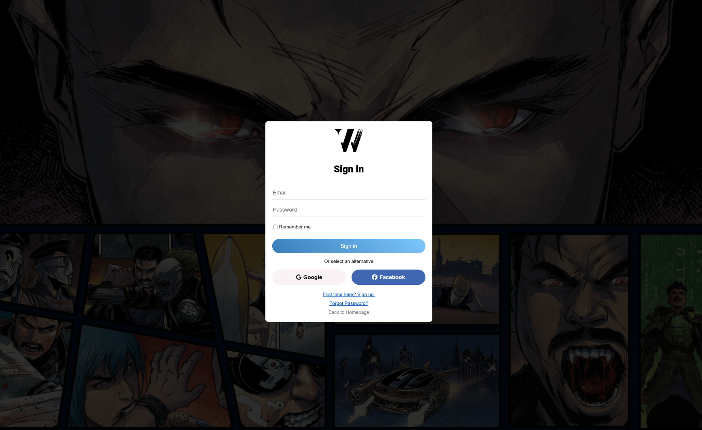
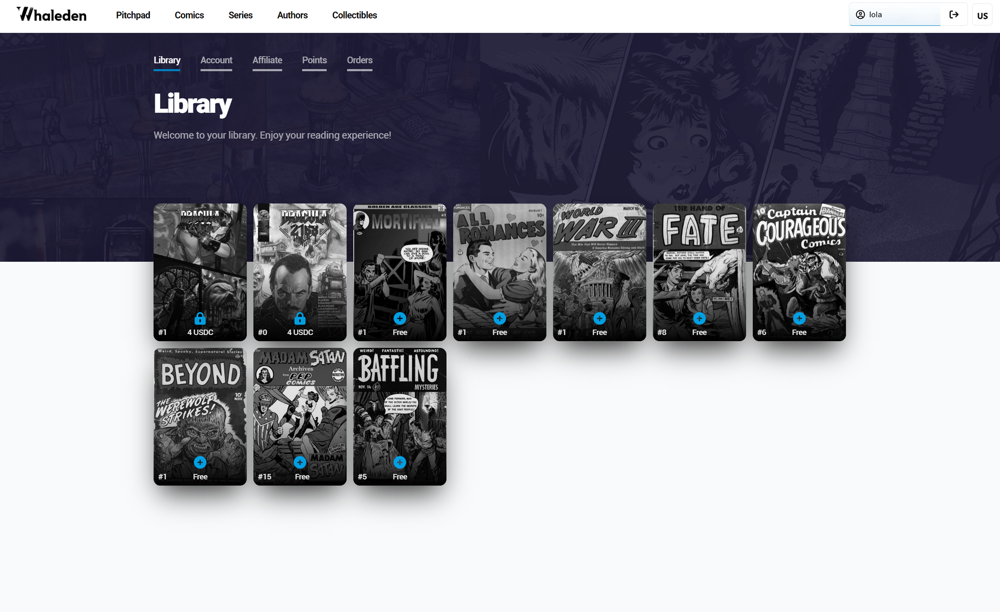
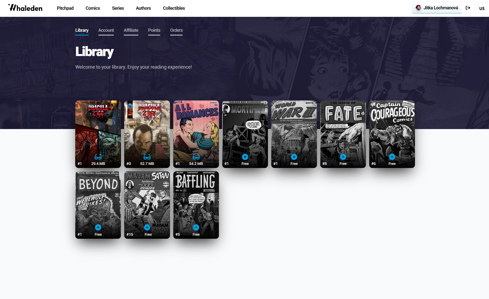
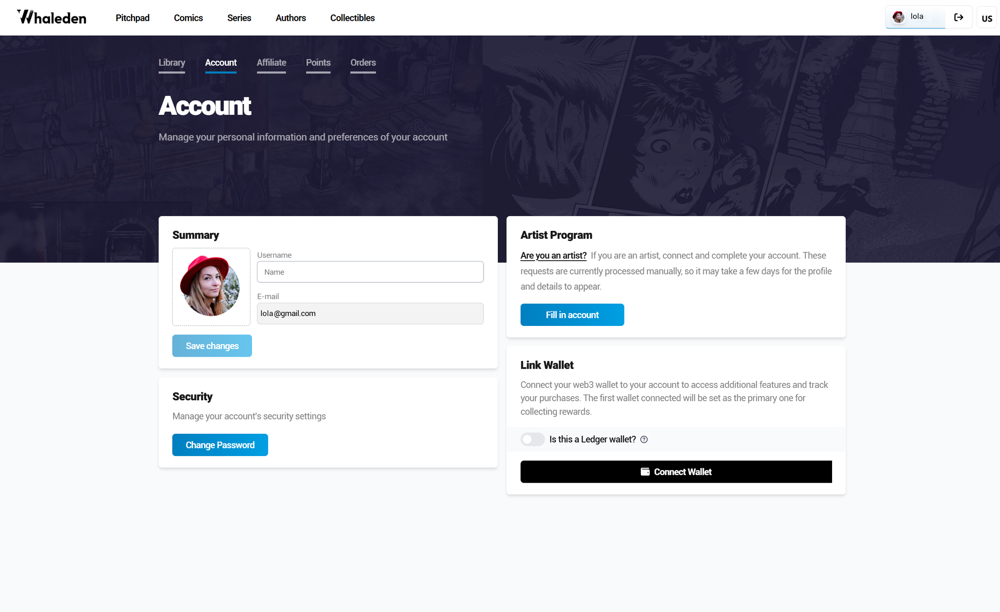
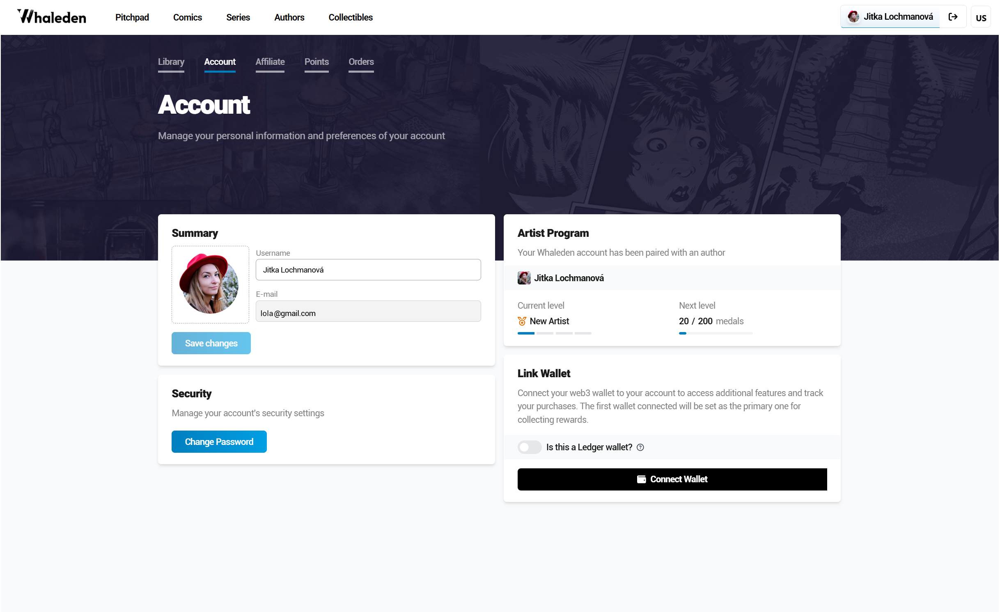
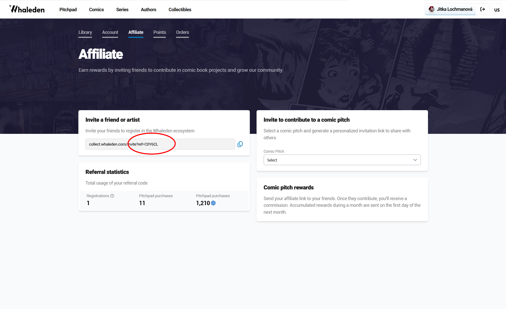
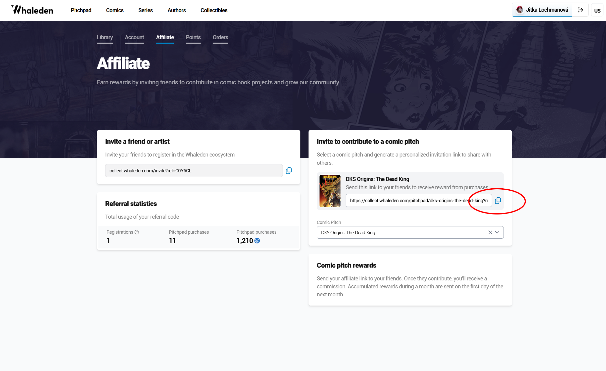
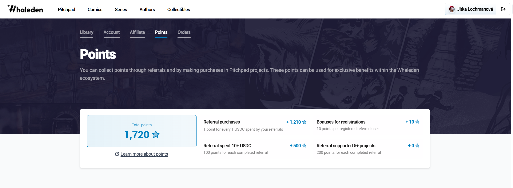

# Create an Account

*This guide will help you get started with the Whaleden platform - from signing in to exploring your account and earning rewards.*

### **1) Open the platform**

Go to our platform

* on, <https://collect.whaleden.com/> or
* on our [homepage](https://whaleden.com/), click the “Launch App” button in the top right corner.

### 2) Sign in

Click the “Sign in” button in the top right corner.

A window will open where you can sign in using your email or supported social logins.

!!! warning
    Use your email consistently - this ensures your rewards and commissions are correctly linked.

### 3) Your Account

You will be taken to your account with sections

### 📚 Library

Here you can:

* read your purchased comics
* buy new comics
* access selected Golden Age comics for free

**Color images indicate that the content is available to read.** Once you purchase or unlock a comic for free, its preview will change from black and white to full color.

### 👤 Account

Here you manage your profile:

* your name and email (already linked to your account)
* once you fill in your name, it will automatically appear in the top right corner
* you can upload your profile picture here

#### **Option to apply as an artist and receive commissions**

You can apply as an artist by filling out the portfolio form and start receiving job opportunities.

Once you apply, the section that originally contained the form link will change to the **Artist Program** section the next time you sign in.

!!! info
    **More info for artists here:** [Whaleden Artists Page](https://whaleden.com/artists)

### 💸 Affiliate

Here you can start earning:

* create your own affiliate link to invite artists and fans
* see how many people have signed up through your link
* track how many projects you’ve supported and the rewards you’ve earned

You can also create special links for individual comic pitches.

### 🧾 Points

An overview of your collected points:

* earn points through referrals and your purchases
* use points for exclusive benefits within the Whaleden ecosystem

The point system will continue to grow - what you see now is just a small part of what’s coming.  
Every action counts: each referral, artist, or fan you bring in (and their future activity) will gradually earn you more points over time.

### 📦 Orders

* history of your purchases and supported projects

!!! info
    this section is currently under development

### 🚀 How to Earn

Earn rewards by:

* inviting new users through your affiliate link  
  [Affiliate Program](https://whaleden.com/programs/affiliate)
* supporting comic pitches or publishing your own Comic Pitch  
  [Story Pitch Program](https://whaleden.com/programs/story-pitch)
* building a community around projects

The more people you bring in and the more projects you support, the more you earn.
